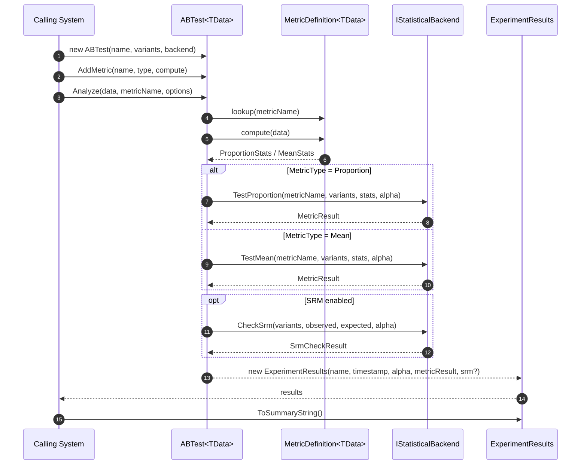
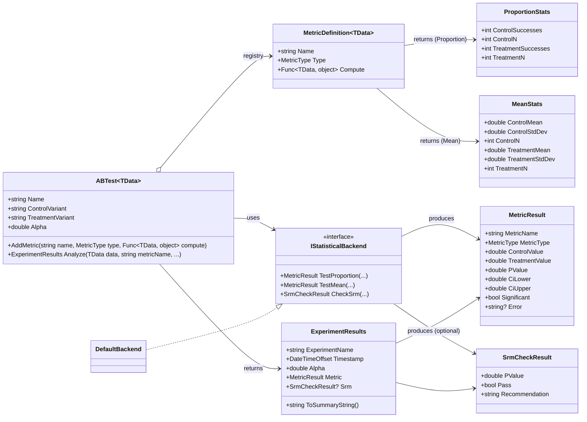

# ab_framework_cs — Design (Minimal C# Port)

## Context
This is a C# re-implementation of the Python `ab_framework` package, intentionally reduced in scope.

The Python core is *schema-agnostic*: the framework does not inspect raw data. Instead, metric functions compute per-variant **summary statistics** from whatever data object the caller provides.

This C# version preserves that core design.

## Goals
- Provide a simple, production-friendly C# library for 2-variant A/B testing.
- Support the same two metric “shapes”:
  - **Binary / Proportion** metrics (conversion rate): integer successes + denominators.
  - **Continuous / Mean** metrics (revenue, latency): mean + standard deviation + sample size.
- v1 focuses on **one primary metric** per analysis (A vs B).
- Produce a strongly-typed results object plus an easy-to-print human summary.
- Keep extension points so we can add additional metrics / monitoring later without breaking the public API.

## Non-Goals (for this phase)
 - No “guardrail metrics/variables” (i.e., we are not supporting multiple secondary/monitor metrics in v1).
 - No automatic variance reduction / CUPED.
- No monitoring / “soft metrics”:
  - No primary vs monitor roles.
  - No per-metric monitor thresholds.
- No multiple-testing corrections (Bonferroni/FDR) in this first version.
- No sequential testing / alpha spending.
- No Bayesian methods.
- No inference of variants from raw data.

## Decisions (Confirmed)
- **Target framework:** `net8.0`
- **Language version:** C# 12
- **Dependencies:** allowed to use `MathNet.Numerics` for distribution/CDF functions
- **Variants:** exactly 2 variants for v1 (labels provided by the calling system; not hardcoded)

Additional scope clarification (v1):
- **Metrics:** exactly 1 primary metric per analysis run.
- **SRM:** allowed as an optional, lightweight quality check (counts-only).

## High-level Architecture
- `ABTest<TData>` orchestrates analysis.
- Metrics are registered on the test using a small registry.
- A statistical backend interface (`IStatisticalBackend`) performs hypothesis tests.
- `ExperimentResults` stores metric results and provides formatting.

### Sequence diagram (runtime flow)


### Class diagram (core types)


### Why `TData` generic?
To keep the framework schema-agnostic and type-safe. Users can pass a `DataTable`, a custom DTO list, a `DataFrame`-like structure, or any domain object.

Important: the library does **not** impose any schema on `TData` (including `DataTable`).
`TData` is passed through unchanged to the caller-owned metric compute function. The metric function (owned by the calling system) is the only place that understands columns/fields.

## Public API (Proposed)

### Core types
- `ABTest<TData>`
- `MetricDefinition<TData>`
- `MetricType` enum
- `IStatisticalBackend`
- `ExperimentResults`
- `MetricResult` (per metric)

### `Analyze(...)` shape (v1)
- `Analyze(data, metricName)` returns results for exactly one metric.
- We can add `Analyze(data, metrics: ...)` later without breaking by overloading.

### Minimal usage example (proportion metric)
```csharp
var test = new ABTest<DataTable>(
    name: "daily_aggregated_conversion",
    variants: new[] { "control", "treatment" },
    backend: new DefaultBackend());

test.AddMetric(
    name: "conversion_rate",
    type: MetricType.Proportion,
    compute: data => {
        // User-owned: interpret schema and return per-variant summary stats
        return new ProportionStats(
            controlSuccesses: SumInt(data, "successes_A"),
            controlN: SumInt(data, "n_A"),
            treatmentSuccesses: SumInt(data, "successes_B"),
            treatmentN: SumInt(data, "n_B"));
    });

      // `inputData` is caller-owned and can be any shape/granularity (daily, hourly, per-user, etc.).
      var results = test.Analyze(data: inputData, metricName: "conversion_rate");
Console.WriteLine(results.ToSummaryString());
```

Notes:
- `DataTable` here is just a convenient example type; you can use any `TData`.
- There is no required `DataTable` schema at the library level. Only your `compute` function cares about which columns exist.
- The library does not assume the data is "daily aggregated"; that was just one motivating example.

### Recommended input pattern for proportion metrics (caller-side)
Many teams store *aggregated* inputs (often daily) rather than raw events. That works well with this library.

**Best option (recommended): provide true integer successes.**
- For each row/time bucket, store integer `successes` and `n` per variant.
- Your `compute` function can sum them across all rows passed to `Analyze()`:
  - `successes_total = sum(successes_row)`
  - `n_total = sum(n_row)`

This avoids rounding error and produces exact cumulative counts.

**Fallback option: provide rates + denominators.**
- If you only have `rate` and `n`, you can derive integer successes as `round(rate * n)` in the `compute` function.
- This is an approximation (usually small), so prefer true successes when available.

## Data & Metric Contracts

### Variants
- Exactly 2 variants for v1.
- Variant labels are **caller-controlled** strings and must be provided up front.
  Examples: `"A"`/`"B"`, `"control"`/`"treatment"`, `"blue"`/`"green"`.

### Metric types
`MetricType`:
- `Proportion` (binary)
- `Mean` (continuous)

### Metric compute function return types
For strong typing and minimal runtime errors, we avoid “dictionary-of-dictionaries” in the C# API.

Instead, each metric compute function returns a **type-specific stats payload**:

- Proportion metric returns `ProportionStats`:
  - `ControlSuccesses` (int)
  - `ControlN` (int)
  - `TreatmentSuccesses` (int)
  - `TreatmentN` (int)

- Mean metric returns `MeanStats`:
  - `ControlMean` (double)
  - `ControlStdDev` (double)
  - `ControlN` (int)
  - `TreatmentMean` (double)
  - `TreatmentStdDev` (double)
  - `TreatmentN` (int)

This matches the Python contract but is more idiomatic in C#.

## Statistical Methods (v1)

### Proportion
- Two-sample z-test for difference in proportions.
- Inputs:
  - successes and denominators per group.
- Outputs:
  - group rates
  - absolute difference (treatment - control)
  - relative lift
  - p-value (two-sided)
  - 95% CI for difference

### Mean
- Welch’s t-test (unequal variances).
- Inputs:
  - mean, std dev, n per group.
- Outputs:
  - difference in means
  - relative lift (optional; for means we can define lift as diff/control)
  - p-value (two-sided)
  - 95% CI for difference

### Numeric dependencies
Implementation choice for v1:
- Use `MathNet.Numerics` for Normal / Student-t distribution functions (p-values, critical values).

This stays encapsulated behind `IStatisticalBackend` so we can swap implementations later if needed.

## Results Model

### `MetricResult`
Proposed fields:
- `MetricName` (string)
- `MetricType` (enum)
- `ControlValue` (double) — rate or mean
- `TreatmentValue` (double)
- `SampleSizeControl` (int)
- `SampleSizeTreatment` (int)
- `Lift` (double) — as fraction; e.g. 0.0671 for +6.71%
- `PValue` (double)
- `CiLower` (double) — CI for (treatment - control)
- `CiUpper` (double)
- `Significant` (bool) — computed as `PValue < Alpha`

Optional (presentational only):
- `StandardErrorControl` and `StandardErrorTreatment` for proportions
- `StdDevControl` and `StdDevTreatment` for means

### `ExperimentResults`
- `ExperimentName`
- `Timestamp` (DateTimeOffset)
- `Alpha` (double)
- `Metric` (single `MetricResult`) for v1
- `ToSummaryString()`
- `ToJson()` (optional later)

### Optional SRM result (v1)
If enabled, include a separate SRM result payload alongside the metric result:
- `SrmCheckResult? Srm`
  - `ExpectedSplit` (e.g., 0.5/0.5)
  - `ObservedCounts` (A count, B count)
  - `PValue`
  - `Pass` (bool)
  - `Recommendation` (string)

## Error Handling
- Fail fast on:
  - unknown metric name requested in `Analyze`
  - invalid sample sizes (`n <= 0`)
  - invalid std dev (`std < 0`)
- Metric compute exceptions should be captured and surfaced per-metric (so one broken metric doesn’t kill the entire run), but v1 can choose either:
  - strict mode (throw), or
  - tolerant mode (record error in `MetricResult`)

Recommendation for v1: **tolerant per-metric** (matches Python behavior and improves usability).

## Extensibility (for future guardrails/monitoring)
We’ll keep these hooks in the object model without implementing behavior now:

- `MetricDefinition<TData>` can later add optional fields:
  - `IsPrimary`, `MonitorAlpha`, `MonitorPower`, `InferiorityMargin`, etc.
- `ExperimentResults` can later add:
  - SRM result section
  - correction method metadata
- `AnalyzeOptions` (future) can carry:
  - `RunSrmCheck`
  - `CorrectionMethod`
  - sequential testing config

## Project Layout (planned)
```
ab_framework_cs/
  DESIGN.md
  src/
    AbFramework/
      AbFramework.csproj
      ABTest.cs
      MetricDefinition.cs
      MetricType.cs
      Stats/
        ProportionStats.cs
        MeanStats.cs
      Backends/
        IStatisticalBackend.cs
        DefaultBackend.cs
      Results/
        ExperimentResults.cs
        MetricResult.cs
  tests/
    AbFramework.Tests/
      AbFramework.Tests.csproj
      ...
```


