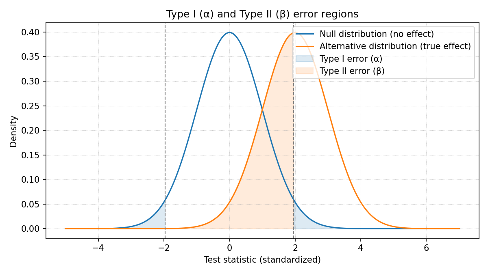
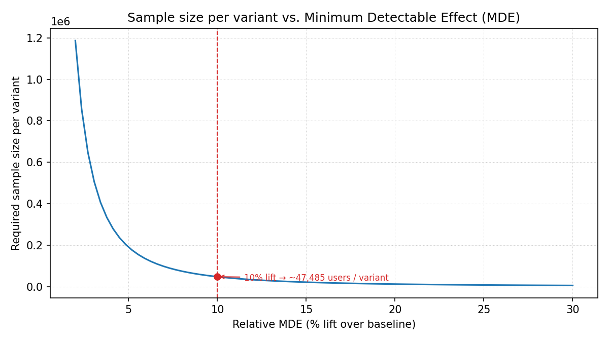
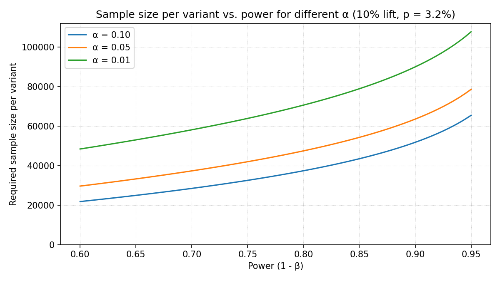
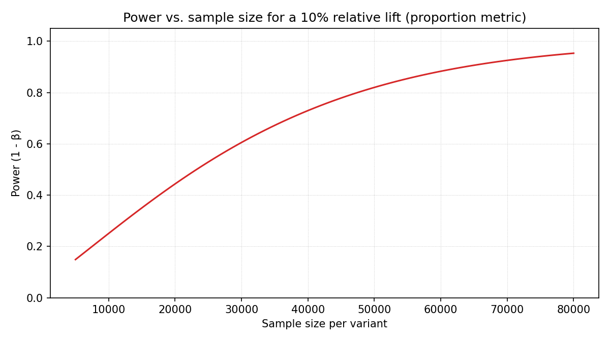
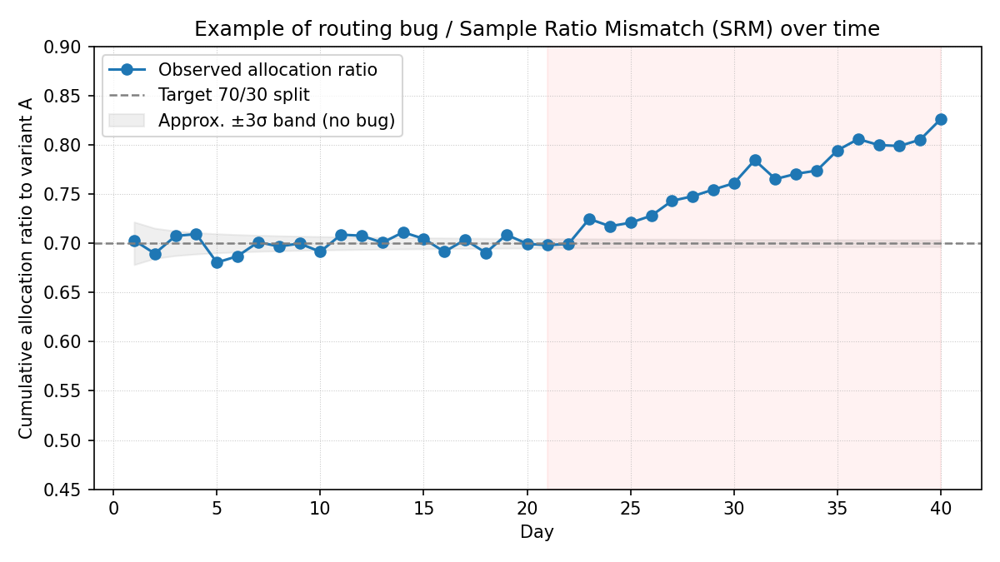

> Purpose: Statistical theory and mathematical background for A/B testing methodology
> Generated: Manually authored, maintained under version control.

[TOC]

# 📘 Practical A/B Testing Theory and Design Guide

> **How to use these docs**
>
> * Use `README.md` as your primary entry point for the package: what the framework does, how to configure it, and example usage.
> * Use this theory guide when you want the underlying statistical theory: detailed formulas, derivations, design trade‑offs, and methodological justifications referenced from the README.

This document gathers the **statistical theory and methodology** that underpins the framework in `README.md`.

It is deliberately more detailed and math-heavy. The goal is that engineers can use the framework with just the README, while data scientists and reviewers can come here for full details and justifications.

---

## 1. Goals and Fundamentals

### What is A/B Testing?

**A/B testing** (also called split testing) is a randomized controlled experiment that compares two or more versions of a product feature, algorithm, or user experience to determine which performs better on specific business metrics.

### Core Goals of A/B Testing

* **Causal Inference**: Establish whether changes directly cause improvements in business metrics
* **Risk Mitigation**: Test changes on a subset before full rollout to minimize potential negative impact
* **Data-Driven Decisions**: Replace intuition and opinions with statistical evidence
* **Continuous Optimization**: Iteratively improve products through systematic experimentation
* **Business Impact Measurement**: Quantify the effect of changes on key performance indicators (KPIs)

### Key A/B Testing Methodology

#### 1. Hypothesis Formation

```text
H₀ (Null): No difference between variant A and variant B
H₁ (Alternative): Variant B performs better than variant A by at least X%
```

#### 2. Experimental Design

* **Randomization Unit**: Define what gets randomized (users, sessions, accounts)
* **Traffic Allocation**: Determine split ratio (50/50, 90/10, etc.)
* **Success Metrics**: Primary and secondary metrics to measure
* **Guardrail Metrics**: Metrics that must not be negatively affected

> **Important design principle of this framework**  
> This framework is intentionally **not** an experimentation platform. It does not decide *who* sees control or treatment and it does not collect raw logs. Those responsibilities stay in your own product / experimentation system. This package assumes you already have:
>
> 1. An **assignment table**: `unit_id → variant_label` (produced by your assignment logic, e.g., values like "control" or "treatment")
> 2. An **events/metrics table**: logs of what happened for each `unit_id`
>
> Given only these inputs and your metric definitions, the framework focuses purely on the **math and methodology**: sample size, hypothesis tests, monitoring, and Go/NoGo decisions.

---

## 2. Choosing the Unit of Randomization vs. Unit of Analysis

One of the first practical decisions in any experiment is: **"What is my unit?"**

The golden rule is:[^kohavi-unit]

> **Unit of randomization = Unit of analysis**

This keeps your statistics valid and your interpretation simple: you analyze the same entity you randomized.

### Example Dilemma: Users, Conversations, and Sessions in a Bot System

Imagine your product is a **bot assistant**:

* You have **users** (with `user_id`)
* Each user can open multiple **conversations** (with `conversation_id`)
* A single conversation with an agent can stay **open for days**, and is split into multiple **sessions** according to your sessionization logic (e.g., inactivity timeout, reopen rules), each with its own `session_id`
* You want to change the bot logic and run an A/B test

This gives you a natural hierarchy:

```text
user_id → conversation_id → session_id
```

You now face a natural question:

> Should the **unit_id** be `user_id` or `session_id`?

Both choices are legitimate, but they answer **slightly different questions** and affect both user experience and statistical properties.

### Option 1: Randomize by `user_id`

**What it means**

* Each user is assigned once to an experiment variant (e.g., variant A or variant B — in many systems named control and treatment)
* All conversations for that user follow the same variant during the experiment

**Pros**

* **Consistent experience** per user – the same human always sees the same behavior
* Natural for user-level metrics:
    * "% of users with at least one resolved conversation"
    * "Average conversations per user per week"
    * "User retention after N days"
* Easier interpretation: "If a user is exposed to B instead of A, how does their behavior change?"

**Cons**

* Fewer independent units than conversations → may require **longer duration** for the same power

**When to prefer `user_id` as unit**

* Your primary metrics are **user-centric** (engagement, satisfaction, retention)
* You care about a **stable, predictable** experience for the same person
* Conversations for the same user are clearly **not independent** (very common)
 
If you randomize by `user_id`, you should also **analyze metrics at user level** (aggregate conversation data per user before running tests).

### Option 2: Randomize by `session_id`

**What it means**

* Each new **session** is randomized independently to A or B
* The same user (and even the same long‑lived conversation) can see A in some sessions and B in others

**Pros**

* Many more units (sessions) → potentially **shorter tests** for **session‑level** metrics
* Direct answer to: "Does the treatment improve metrics **per session**?" (e.g., resolution rate per session, average handling time per session)

**Cons**

* The same user can experience **mixed behavior** (sometimes variant A, sometimes variant B across sessions)
* User-level interpretation becomes more complex (each user sees a blend of both variants / treatments)
* Sessions from the same user are often **correlated**; naive per‑session analysis can **overstate significance** unless you use clustered/robust methods

**When to prefer `session_id` as unit**

* Your primary metric is truly **per-session**, and user-level experience consistency is less critical
    * e.g., "resolution rate per session", "average handling time per session"
* Sessions are relatively **independent tasks** from the user's perspective (even if they belong to the same long‑running conversation)

### Randomize by `conversation_id`, analyze by `session_id`

In many real systems (including this bot example), you can also **randomize at `conversation_id` and analyze at `session_id`**:

* Each **conversation** is assigned once to A or B (unit of randomization = `conversation_id`).
* All **sessions within that conversation** inherit the same treatment, so they are valid sub‑units for analysis.

In that setup, you typically:

* Run primary tests at the **conversation level** (respecting the randomization unit), and
* Optionally use **session‑level aggregates** for richer diagnostics, with cluster‑robust methods that **cluster by `conversation_id`**.

For example, when using regression models with clustering:

* The model specification includes the variant assignment as a predictor
* Standard errors are computed with cluster-robust covariance estimation
* Clustering is performed at the randomization unit level (e.g., `conversation_id`)
* This produces valid inference even when analyzing lower-level units (e.g., sessions)
* The treatment coefficient estimate remains unchanged; only its standard error is adjusted

### Practical guidance

For most product scenarios (including the bot use case), the recommended **default** is:

* Choose **`user_id` as the `unit_id`** (unit of randomization)
* Aggregate session / conversation events to **user-level metrics** (unit of analysis)

Conversation-level randomization (`conversation_id`) is still valid, but should be a deliberate choice when:

* The experiment is focused on **conversation-level operations** where an entire conversation is the natural indivisible unit, and
* You are comfortable with users seeing a **mix of variants (e.g., control/treatment or A/B) across different conversations and sessions**, and
* You adjust your statistical analysis to respect the correlation between conversations/sessions of the same user.

In short:

> Start with **user-level experiments** for user-centric metrics and experience.  
> Use **conversation-level experiments** for low-level operational metrics, with careful analysis.

---

## 3. Statistical Framework & Math Cheat‑Sheet

### High-level role of the statistical engine

At a high level, the framework’s statistical engine answers:

> "Given my baseline performance, desired minimum detectable effect (MDE), significance level (α), and power, how many units do I need — and, once I have data, is the observed difference real or just noise?"

We mainly use:

* **Proportion tests** for rate metrics (e.g., conversion, CTR)
* **Mean tests** for continuous metrics (e.g., revenue per user, time)
* **Confidence intervals** to express uncertainty around the estimated lift

These choices follow standard A/B testing practice (e.g., z‑tests for proportions and Welch’s t‑test for means; see common treatments in introductory statistics texts or Kohavi et al., *Trustworthy Online Controlled Experiments*).

For quick reference inside this framework, we will often summarize the core statistical knobs as:

* **Significance level (α)** – risk of a false positive (Type I error), typically 0.05
* **Statistical power (1−β)** – probability of detecting a true effect, typically 0.8
* **Minimum Detectable Effect (MDE)** – the *smallest business‑relevant change* you want to be able to detect
* **Sample size** – number of randomized units needed to reach your chosen α, power, and MDE

Recall that **Type I error (α)** is a *false positive* (you conclude there is an effect when in truth there is none), and **Type II error (β)** is a *false negative* (you miss a real effect). In the figure below, the x‑axis is the **standardized test statistic** (z‑score): 0 means "no difference" under the null, values like 2 or −2 mean "two standard deviations away" from that null. The blue curve shows the null world (no effect), the orange curve shows a world with a real effect, and the vertical dashed lines mark the decision thresholds for a two‑sided test with α = 0.05. The following illustration shows how these error regions relate to the knobs above in a simple z‑test setup:



### A) Proportion / rate metrics (conversion rate, CTR, etc.)

Let:

* $p_A$ = conversion rate in control  
* $p_B$ = conversion rate in treatment  
* $n_A$, $n_B$ = sample sizes per group  
* $\Delta = p_B - p_A$ = absolute difference

Approximate **standard error** of a proportion near baseline $p$ (for planning):

$$
	ext{SE}(p) \approx \sqrt{\frac{p(1-p)}{n}}
$$

For the **difference in proportions** during analysis, we use a pooled standard error and compute a z‑statistic:

$$
Z = \frac{\Delta}{\text{SE}_\text{pooled}}
$$

A stats library then converts $Z$ into a **p‑value**; if $p_\text{value} < \alpha$, the result is *statistically significant*.

### B) Continuous metrics (revenue per user, time, etc.)

Let:

* $\mu_A$, $\mu_B$ = sample means per group  
* $s_A$, $s_B$ = sample standard deviations  
* $n_A$, $n_B$ = sample sizes

The **standard error of the mean** is approximately:

$$
	ext{SE}(\mu) \approx \frac{s}{\sqrt{n}}
$$

For the difference in means, we use a (Welch) **t‑test**:

For the difference in means, we use a (Welch) **t‑test**:

$$
t = \frac{\mu_B - \mu_A}{\text{SE}_\text{diff}}
$$

Again, a stats library converts $t$ into a p‑value and confidence interval.

### C) Sample size for proportion metrics

For a proportion metric with equal split between control and treatment, a standard approximation for **required sample size per group** is:

$$
n_{\text{per group}} \approx 2 \cdot (Z_{\alpha/2} + Z_{\beta})^2 \cdot \frac{p(1-p)}{\text{MDE}^2}
$$

Where:

* $Z_{\alpha/2}$ = critical value for significance level (e.g., 1.96 for $\alpha = 0.05$)  
* $Z_{\beta}$ = critical value for power (e.g., 0.84 for power = 0.8)  
* $p$ = baseline rate (e.g., current conversion rate)  
* **MDE** = absolute minimum detectable effect (e.g., 10% relative lift on 3.2% → 0.0032 absolute)

This is the formula used by the framework's backend planning API (for example, `StatisticalBackend.sample_size_proportion` in the default backend implementation).

To build intuition, the next figure shows that **the smaller the effect you want to detect (MDE), the more users you need in each variant**, even when the baseline rate stays the same. The red marker highlights a common planning example: detecting a **10% relative lift** over the baseline and how many users per variant that would require:



### D) Clustered standard errors (when observations are grouped)

In many practical experiments, the **randomization unit** and the **raw rows in your dataset** are not the same:

* You might randomize at **user** or **conversation** level, but observe multiple **sessions** or **events** per unit.
* Those rows inside the same user/conversation are typically **correlated** (same person, same context).

If you naively treat all rows as independent and use standard formulas for the standard error, you will typically **underestimate variance** and get p‑values that are **too optimistic**.

Cluster‑robust standard errors fix this by:

1. Keeping the **same point estimate** (e.g., difference in means or regression coefficient), but  
2. Changing how the **variance of that estimate** is computed, so that residuals are allowed to be arbitrarily correlated **within** a cluster (user, conversation) but treated as independent **across** clusters.

Very schematically, for a linear model with design matrix $X$, coefficients $\hat{\beta}$, and clusters $g = 1, \dots, G$:

$$
\widehat{\text{Var}}_{\text{cluster}}(\hat{\beta})
    = (X'X)^{-1} \Bigg( \sum_{g=1}^G X_g' \hat{u}_g \hat{u}_g' X_g \Bigg) (X'X)^{-1},
$$

where $X_g$ and $\hat{u}_g$ are the rows of $X$ and residuals corresponding to cluster $g$.

**When to use clustered SEs**

* Whenever **randomization happens at a higher level** than the rows you are modeling.
    * e.g., randomize by `conversation_id`, analyze per‑session rows → **cluster by `conversation_id`**.
    * e.g., randomize by `user_id`, analyze per‑event rows → **cluster by `user_id`**.
* Rule of thumb: **cluster at least at the level of randomization**. If in doubt, cluster by the highest natural grouping (usually users).

In the conversation/session example above (conversation‑level randomization, session‑level analysis), we use this clustered variance to keep inference aligned with the randomization unit.

---

## 4. Sample Size Determination and Experiment Planning (high level)

This section captures the **conceptual foundations** of sample size and planning. The concrete helper functions and configuration examples live in `README.md`.

### 4.1 Inputs to sample size calculations

To design an experiment you typically need:

#### Statistical parameters

* **Significance level (α)** – risk of a false positive (Type I error). A common choice is $\alpha = 0.05$.
* **Power (1−β)** – probability of detecting a true effect (1 minus Type II error). A common choice is power = 0.8.

#### Business parameters

* **Baseline level** – current performance of the control variant (rate, mean, etc.).
    * Example: current conversion rate = 3.2% (0.032).
* **Minimum Detectable Effect (MDE)** – smallest change worth detecting, usually defined **relative to the baseline**.
    * Example: baseline = 70% (0.7), MDE = 10% relative improvement → test 0.7 vs 0.77, not 0.7 vs 0.8.
* **Traffic allocation** – proportion of total traffic you are willing to send into the experiment and how you split it between variants (e.g., 50/50 vs 90/10).

#### Metric‑type considerations

* **Proportion metrics** (CTR, conversion rate) – use binomial/normal approximations or exact tests.
* **Continuous metrics** (revenue, time, amount) – require a variance estimate from historical data.
* **Count metrics** (page views, purchases) – may call for Poisson or negative‑binomial models.

### 4.2 Conceptual workflow for planning

At a high level, planning an experiment follows this chain:

```text
Choose α and power → Define meaningful business impact → Translate to MDE →
Choose metric and baseline → Compute required sample size → Map to duration via traffic
```

The framework’s helpers (described in the `README.md` examples) automate the last part of this chain given your choices of α, power, baseline, MDE, and traffic.

To see how **changing α and power** affects planning, consider holding the baseline rate (3.2%) and relative lift (10%) fixed. The next figure shows the required sample size per variant as you ask for higher power (moving right on the x‑axis), for three common α choices (0.10, 0.05, 0.01). Stricter α (smaller values) and higher power both push the required sample size up:



The following plot complements this workflow by showing how **power increases with sample size** for a fixed proportion metric and a fixed relative lift. It makes clear why under‑powered experiments (too few units per variant) will struggle to detect even meaningful effects:



### 4.3 Practical considerations

When interpreting required sample sizes and planned durations, you should also account for:

* **Seasonality** – weekly or monthly cycles can change baseline behavior; avoid planning over an unrepresentative window.
* **External factors** – marketing campaigns, product launches, outages, and holidays can all distort results.
* **Multiple testing** – if you look at many metrics or peek frequently, your effective false‑positive rate grows; use corrections or pre‑defined monitoring rules.
* **Variance reduction** – methods like CUPED or stratification can reduce variance and therefore reduce required sample size without changing α or power.

These considerations are general to A/B testing, regardless of the specific implementation. The `README.md` shows how this framework exposes them via configuration fields and backend planning helpers such as `sample_size_proportion` and `sample_size_mean` on the `StatisticalBackend` interface.

---

## 5. A/A Testing: Infrastructure Validation

Before running any A/B test with real treatment effects, best practice is to conduct an **A/A test**: both groups receive the *same* treatment (typically the current production experience), and you verify that the experimentation infrastructure produces valid results.

### 5.1 Why do we prefer to have A/A tests?

**The fundamental problem:** You are about to trust your experimentation infrastructure with business-critical decisions worth potentially millions of dollars. How do you know it works correctly?

An A/A test is like a **pre-flight check** before taking off. You wouldn't fly a plane without verifying the instruments work. Similarly, you shouldn't run an A/B test without verifying your experimentation system works.

**What could go wrong without A/A testing?**

Consider these real-world failure modes that A/A tests catch:

1. **Silent randomization bugs**
    - Example: "New users always get treatment, returning users get control"
    - Impact: Results are completely invalid, but you won't know without A/A testing
    - A/A test catches it: You'll see systematic differences where there should be none

2. **Data pipeline issues**
    - Example: "Treatment events are logged with 50ms extra latency due to a subtle code path"
    - Impact: Appears treatment is slower, but it's just measurement bias
    - A/A test catches it: Performance metrics show artificial differences

3. **Metric calculation bugs**
    - Example: "Control uses cached aggregation, treatment computes fresh (both should be identical)"
    - Impact: Metrics differ due to implementation, not user behavior
    - A/A test catches it: Same data produces different metric values

4. **Unknown variance**
    - Example: "Historical data says variance = 0.5, but actual system has variance = 0.8"
    - Impact: Your power calculations are wrong, experiment runs too short
    - A/A test provides: Accurate variance from your actual system

**Cost of NOT doing A/A testing:**

| Without A/A test | With A/A test |
|------------------|---------------|
| Ship broken features based on invalid data | Catch bugs before they cause damage |
| Waste weeks on underpowered experiments | Use accurate variance for power calculations |
| Lose credibility when stakeholders find bugs | Build trust with validated infrastructure |
| Debug in production during critical A/B tests | Debug in safe A/A phase before real experiments |

**The A/A test guarantee:**

> If your A/A test passes cleanly, you can trust your A/B test results. If it fails, you just saved yourself from making a bad decision based on broken data.

### 5.0.1 Traffic and Data Quality Monitoring (daily checks)

Even with correct statistical tests, an experiment can silently break if **traffic or logging stops flowing** (for example, a bug that stops assigning users to a variant or drops events). This is not a problem of p‑values, but of **data quality and volume**.

We therefore recommend treating **daily traffic monitoring** as a first‑class part of your experimentation practice:

1. **Daily variant counts**  
    Track per‑day counts of randomized units by variant, e.g. $n_A(d)$ and $n_B(d)$ for day $d$.
    * Compare $n_A(d) + n_B(d)$ against an expected range from historical traffic.
    * Alert if total traffic drops sharply (e.g., < 70–80% of expectation) or is near zero.
    * Alert if only one variant receives traffic (e.g., $n_A(d) = 0$, $n_B(d) > 0$), which indicates an assignment bug.

2. **Cumulative growth sanity check**  
    Plot cumulative sample sizes $n_A^{\text{cum}}(d)$ and $n_B^{\text{cum}}(d)$ over calendar time.
    * They should be **monotone increasing** while the experiment is live.
    * If the cumulative curves **plateau** while your application still has normal traffic, this is a strong signal that logging or assignment has broken.

3. **Allocation ratio monitoring**  
    Monitor the realized allocation ratio
    $$
    r(d) = \frac{n_A^{\text{cum}}(d)}{n_A^{\text{cum}}(d) + n_B^{\text{cum}}(d)}
    $$
    * For a 70/30 experiment (as in the illustrative plot), $r(d)$ should stay close to $0.7$; large or sudden deviations suggest randomization or routing bugs.
    * This is the same idea as an **SRM (Sample Ratio Mismatch)** check, but viewed as a time series.



In the provided graph, a simulated "routing bug" is introduced around Day 21 for a planned **70/30 traffic split**. You can see the ratio begin to drift away from the $0.7$ baseline and eventually leave the gray ±3σ band that represents normal random noise. Such sudden or sustained deviations are strong indicators of a randomization failure, sample ratio mismatch (SRM), or a bug in the assignment logic

4. **Missing / malformed assignment and metrics**  
    Track the fraction of rows with missing or invalid `variant_label` or corrupted metric fields.
    * Sudden spikes indicate issues in upstream tagging or data pipelines.
    * This is especially important when rolling out new logging code alongside experiments.

5. **“Is today’s sample good enough?”**  
    Per‑day cuts are often **not individually powered**; what matters is that cumulative sample size eventually reaches the planned requirement from Section 4. Still, daily samples should not be pathologically small:
    * For proportion metrics, a common rule of thumb is $p \cdot n$ and $(1-p) \cdot n$ both ≥ 5–10 per variant if you want to interpret a daily estimate.
    * In practice, many teams only treat daily cuts as **diagnostic** when there are at least a few hundred units per variant.

Together, these checks answer two operational questions:

* **“Are we still getting enough data each day?”**  
  (If not, you may need to extend the experiment or fix a traffic drop.)
* **“Would we notice if a bug stopped generating or logging samples?”**  
  (Daily count and cumulative growth monitors should fire alerts well before you make decisions based on broken data.)

Importantly, these monitoring and alerting mechanisms live in your **experimentation / data platform**, not inside this analysis library. The framework assumes that, by the time data reaches it, basic traffic and logging sanity checks have already passed.

### 5.1.1 Purpose of A/A testing (detailed)

An A/A test validates the **null hypothesis machinery** itself:

> Under the null hypothesis of *no effect*, do we correctly observe no significant difference most of the time?

This addresses several critical infrastructure questions:

1. **Randomization**: Does the assignment mechanism produce balanced groups?
2. **Metric collection**: Are metrics computed consistently across variants?
3. **Implementation bugs**: Are there code paths that differ between variants even when both should be identical?
4. **Variance estimation**: What is the actual baseline variance for sample size planning?

**Concrete validation checklist:**

| Infrastructure component | What A/A validates | How it catches bugs |
|-------------------------|-------------------|-------------------|
| Randomization logic | Traffic splits match design (e.g., 50/50) | SRM check: chi-square test on user counts |
| Metric computation | Same users produce same metrics | p-value should be > 0.05 |
| Code paths | No variant-specific behavior | Any systematic difference indicates a bug |
| Data pipeline | Logging/filtering is symmetric | Sample sizes and distributions should match |
| Variance | Real-world variability | Observed std matches or exceeds expectations |

### 5.2 Expected behavior in an A/A test

In an A/A test, you expect:

* **No significant difference** in the primary metric (p-value > α, typically > 0.05)
* **Small observed lifts** due to random sampling noise (typically < 2–3%)
* **No Sample Ratio Mismatch** (SRM check passes)
* **Stable variance estimate** after sufficient data collection

**Interpreting p-values in A/A tests:**

Unlike A/B tests where p < 0.05 indicates success, in A/A tests:

$$
\begin{align*}
p > 0.05 &\implies \text{PASS (expected — no difference detected)} \\
p < 0.05 &\implies \text{FAIL (unexpected — infrastructure problem)}
\end{align*}
$$

If you run an A/A test and observe p < 0.05, this is a **red flag** indicating:

* Randomization bug (e.g., systematic assignment based on user characteristics)
* Metric collection bias (e.g., one variant logs events differently)
* Implementation error (e.g., code paths diverge even when treatments are identical)

### 5.3 Duration and sample size for A/A tests

The goal of an A/A test is twofold:

1. **Validate infrastructure** (requires enough data to detect bugs)
2. **Estimate variance** (requires stable variance estimate)

**Recommended guidelines:**

| Criterion | Recommendation |
|-----------|----------------|
| Minimum samples per variant | 300–500 units |
| Minimum duration | 7 days (full week to capture day-of-week effects) |
| Variance convergence | Continue until variance estimate stabilizes |

**Why 7 days minimum?**

Most products exhibit **weekly seasonality** (e.g., weekday vs. weekend behavior). Running for at least one full week ensures your variance estimate incorporates this natural variation.

**Traffic-based guidelines:**

For products with varying traffic levels:

| Daily traffic | Recommended duration |
|--------------|---------------------|
| < 50 units/day | 10–14 days (need more time to reach 300+ per variant) |
| 50–100 units/day | 7–10 days |
| 100–200 units/day | 7 days |
| 200+ units/day | 3–7 days (high volume allows faster validation) |

### 5.4 Using A/A results for A/B planning

The A/A test provides two critical inputs for your subsequent A/B test:

1. **Baseline mean** ($\mu_0$): More accurate than historical estimates
2. **Baseline standard deviation** ($\sigma_0$): Reflects actual variability in your system

Use these values in sample size calculations:

```
For continuous metrics:
n ≈ (Z_α/2 + Z_β)² × (2σ₀²) / (μ₀ × MDE)²

Where:
  μ₀ = control_mean from A/A test
  σ₀ = std_pooled from A/A test
  MDE = relative minimum detectable effect (business requirement)
```

This produces more accurate sample size estimates than using historical data or assumptions.

### 5.5 False positive rate and A/A tests

By design, with α = 0.05, you expect:

$$
P(\text{false positive in single A/A test}) = 0.05
$$

This means if you run 20 A/A tests, you expect about 1 to show p < 0.05 *by chance alone*. This is **not** a bug — it's how hypothesis testing works.

However, if you observe:

* **Multiple consecutive A/A failures** (e.g., 3+ in a row with p < 0.05), or
* **Extreme p-values** (e.g., p < 0.001), or
* **SRM violations** (sample ratio mismatch detected)

Then you likely have a real infrastructure problem that must be fixed before proceeding to A/B testing.

### 5.6 Common A/A test failure modes

| Symptom | Likely cause | Action |
|---------|-------------|--------|
| p < 0.05, large effect (> 5%) | Randomization bug or metric collection bias | Investigate assignment logic and metric computation |
| p < 0.05, small effect (< 3%) | Possibly chance (run another A/A) | Re-run; if persists, investigate |
| SRM detected (χ² test fails) | Assignment bug, data pipeline issue | Check randomization and data collection |
| Unstable variance across days | Seasonality or external events | Extend duration to capture full cycles |

### 5.7 A/A testing in practice

**Recommended workflow:**

```
Phase 0: A/A Test (7+ days)
  ↓
  Validate: p > 0.05, no SRM, stable variance
  ↓
  Extract: μ₀, σ₀ for sample size calculation
  ↓
Phase 1: Sample Size Planning
  ↓
  Use A/A parameters for accurate power analysis
  ↓
Phase 2: A/B Test
  ↓
  Run with validated infrastructure and accurate sample size
```

By investing in A/A testing upfront, you gain:

* **Confidence** in infrastructure (no silent bugs)
* **Accurate variance** for sample size (avoid under/overpowering)
* **Baseline estimate** closer to reality than historical data
* **Documentation** of system behavior for future experiments

---

## 6. Data Quality, SRM, and Sequential Monitoring

This section collects the theory behind **data quality checks** and **sequential monitoring** that the framework expects users to understand, even though the concrete checks and configuration live in the package API.

### 6.1 Data quality and Sample Ratio Mismatch (SRM)

Even a perfectly specified hypothesis test is only as trustworthy as the **data** fed into it. A key failure mode in online experiments is **Sample Ratio Mismatch (SRM)**:

> You planned to send, say, 50% of units to control and 50% to treatment, but the observed allocation in your logged data is materially different.

Common causes include:

* Bugs in randomization or routing logic
* Silent drop of events in one branch
* Filtering or eligibility rules applied asymmetrically
* Clock/time‑zone bugs or partial log ingestion

#### SRM as a χ² goodness‑of‑fit test

The standard way to diagnose SRM is a **chi‑square (χ²) goodness‑of‑fit test** on the **counts of units** per variant.

Suppose you planned a 50/50 split and observed:

* $n_A$ units in control
* $n_B$ units in treatment

Let $N = n_A + n_B$ and the **expected** counts under the design be $E_A = E_B = N/2$. The chi‑square statistic is:

$$
\chi^2 = \sum_{v \in \{A,B\}} \frac{(n_v - E_v)^2}{E_v}.
$$

**Example calculation for 50/50 split:**

```
Expected: 500 control, 500 treatment (N = 1000)
Observed: 450 control, 550 treatment

χ² = (450 - 500)² / 500 + (550 - 500)² / 500
    = 2500 / 500 + 2500 / 500
    = 5.0 + 5.0
    = 10.0

With 1 degree of freedom:
p-value ≈ 0.0016

Since p < 0.001 → SRM DETECTED
```

Under the null hypothesis of *no SRM* (i.e., routing behaves as designed), this statistic is approximately χ²‑distributed with 1 degree of freedom, and a p‑value $p_\text{SRM}$ is obtained from that distribution.

**P-value interpretation for SRM:**

The p-value answers: "If randomization was working correctly, how surprising is this mismatch?"

* $p > 0.001$: ✅ Mismatch within normal random variation
* $p < 0.001$: ❌ Mismatch too extreme to be chance alone

**Why alpha = 0.001 for SRM (not 0.05)?**

Unlike metric tests which use $\alpha = 0.05$, SRM checks use a **stricter threshold** of $\alpha = 0.001$:

* **Metric tests**: Balance false positives vs false negatives (both costly)
* **SRM checks**: Only flag when **extremely confident** something is broken
* **Rationale**: Day-to-day traffic variation can cause minor imbalances; we only want alarms for serious issues

This means:
* If $p_\text{SRM} = 0.002$ (between 0.001 and 0.05): Mismatch is notable but might be random variation → monitor closely
* If $p_\text{SRM} = 0.0001$ (much less than 0.001): Almost certainly a real problem → stop and investigate

#### SRM for non-50/50 splits

The framework supports arbitrary traffic allocations. For a 70/30 split (70% control, 30% treatment):

$$
\begin{align*}
E_A &= 0.7 \times N \\
E_B &= 0.3 \times N
\end{align*}
$$

**Example with 70/30 allocation:**

```
Expected: 700 control, 300 treatment (N = 1000)
Observed: 680 control, 320 treatment

χ² = (680 - 700)² / 700 + (320 - 300)² / 300
    = 400 / 700 + 400 / 300
    = 0.571 + 1.333
    = 1.904

p-value ≈ 0.168 → No SRM (within normal variation)
```

**Framework implementation:**

The framework accepts a `treatment_fraction` parameter representing the **treatment allocation** (the proportion of traffic allocated to treatment). When the SRM check is executed during analysis, the framework:

1. Computes expected counts based on the allocation ratio and total sample size
2. Calculates the χ² statistic comparing observed vs expected counts
3. Derives the p-value from the χ² distribution with 1 degree of freedom
4. Returns a comprehensive result containing:
    - Boolean pass/fail indicator
    - Exact p-value and chi-square statistic
    - Observed and expected counts per variant
    - Percentage deviations from expected
    - Human-readable recommendation for action

#### Per-day SRM monitoring

Best practice is to check SRM **daily** throughout the experiment, not just at the end:

**Why daily monitoring?**

1. **Early detection**: Catch randomization bugs quickly
2. **Temporal patterns**: Identify if SRM appears on specific days (e.g., weekends)
3. **Drift detection**: Spot gradual accumulation of imbalance
4. **Root cause analysis**: Correlate SRM with deployments or external events

**Statistical interpretation of daily monitoring:**

When monitoring SRM over time, each day's data produces:

* An observed Treatment/Control ratio
* A 95% confidence interval around that ratio
* A comparison against the expected ratio from the experimental design

The key diagnostic principle is whether the confidence interval **includes or excludes** the expected ratio:

* **CI includes expected ratio**: The observed imbalance is consistent with random sampling variation → No evidence of SRM
* **CI excludes expected ratio**: The observed imbalance is statistically incompatible with the design → Strong evidence of SRM → Investigation required

For example, with a 50/50 design (expected T/C ratio = 1.00):
* Day 1: T/C = 1.05, CI = [0.92, 1.18] → CI includes 1.00 → No SRM detected
* Day 2: T/C = 1.23, CI = [1.12, 1.34] → CI excludes 1.00 → SRM detected → Stop and investigate

This approach combines the **point estimate** (observed ratio) with its **statistical uncertainty** (confidence interval) to make robust daily decisions about data quality.

The SRM test is conceptually part of a broader **data quality check** that also examines minimum sample sizes, experiment duration relative to plan, external events, and data pipeline health.

**When SRM is detected:**

If $p_\text{SRM}$ is very small (e.g., $< 0.001$), the imbalance is **extremely unlikely** under proper randomization. In that case:

1. **STOP** analyzing metrics immediately
2. **INVESTIGATE** root causes:
    - Randomization logic bugs
    - Data pipeline filtering
    - Technical issues (bot traffic, caching)
    - Variant-specific crashes
3. **FIX** the underlying issue
4. **RESTART** the experiment after validation

Results should be treated as **INCONCLUSIVE** until you investigate and fix the underlying issue. Even statistically significant metric results are **invalid** in the presence of SRM.

### 6.2 Sequential monitoring and peeking

In practice, teams rarely wait strictly until the pre‑planned end of an experiment before looking at results. Every **unplanned peek** at a running p‑value, however, increases the chance of a **false positive** (Type I error) beyond the nominal α.

If you commit in advance to one or more **interim looks**, you should treat the experiment as a **group‑sequential design**:

* The overall experiment is assigned a total α (e.g., 0.05).
* Each interim analysis “spends” part of that α.
* Boundaries such as **O’Brien–Fleming** or **Pocock** specify critical values $Z_1, Z_2, \dots$ for each look so that the **experiment‑level** Type I error stays at 5%.

Conceptually, you can think of an **alpha‑spending function** $\alpha(t)$ that tells you how much of the total α has been spent by information time $t$ (often proportional to cumulative sample size). At each planned look, the instantaneous significance threshold is tighter early on and relaxes as more data accrue.

This framework does **not** implement a full sequential‑design engine. Instead, it:

* Encourages you to plan a small number of interim looks (or none), and
* Surfaces configuration hooks for future extensions (e.g., plugging in alpha‑spending rules), while
* Treating overly frequent, ad‑hoc peeking as a **data quality / process issue** rather than a feature.

The key takeaway for users of this package is methodological:

> Decide on your peeking policy up front, and if you monitor frequently, account for that in your false‑positive budget.

---

## 7. Metric Types and Multiple Metrics

The framework is designed around a **single primary metric per experiment** for clean decision‑making, but in real analyses you often look at **multiple metrics** (primary, guardrail, diagnostics). This section captures the theory behind that choice.

### 7.1 Metric types recap

Broadly, we distinguish:

* **Rate / proportion metrics** – e.g., conversion rate, CTR, success rate
* **Quantity / continuous metrics** – e.g., revenue per user, time on site, items per order
* **Count metrics** – e.g., page views, purchases, events per user (sometimes modeled via Poisson or negative binomial)

From a planning standpoint, rate metrics rely on binomial/normal approximations, continuous metrics rely on variance estimates from historical data, and count metrics may use Poisson‑like models when appropriate. The cheat‑sheet in Section 3 summarizes the core formulas.

### 7.2 Why a single primary metric?

If you **declare one primary metric** per experiment, you can:

* Control the false‑positive rate **directly** at that metric's α
* Keep the **decision logic simple** ("ship if the primary metric passes, subject to guardrails")
* Avoid inflating required sample size to satisfy power requirements across many outcomes

Secondary and guardrail metrics are still analyzed, but they are interpreted with more caution and, if strictly tested, should be treated as a **family of tests**.

### 7.2.1 Metric role taxonomy

In practice, experiments track multiple metrics with different purposes. We recommend organizing metrics into three clear roles:

#### Primary metrics

The **primary metric** is the single success criterion that must show statistically significant improvement for the experiment to be deemed successful.

* **Statistical treatment**: Full power analysis, strict α control
* **Decision weight**: Decisive — experiment "wins" only if primary improves
* **Recommendation**: Exactly **one** primary metric per experiment

**Why one primary?**

1. **Power**: If you have two primaries and require *both* to improve, your effective power is $\text{power}_1 \times \text{power}_2$. For example, two metrics each with 80% power yield joint power of only 64%.
2. **Type I error**: If you require *either* to improve and test each at $\alpha = 0.05$, your family-wise error rate is approximately $1 - (1-0.05)^2 \approx 0.0975$ — nearly 10%!
3. **Simplicity**: "Ship if primary improves" is unambiguous. Multiple primaries create decision paralysis when metrics conflict.

#### Guardrail metrics

**Guardrail metrics** are safety checks: metrics that must *not* degrade significantly. They act as constraints on the decision, not as success criteria.

* **Statistical treatment**: Tested for significant *worsening*; apply multiple‑testing correction
* **Decision weight**: Veto power — even if primary wins, a violated guardrail blocks shipping
* **Recommendation**: 2–5 guardrails (enough to protect key dimensions, not so many that shipping becomes impossible)

**Examples**:

* **E-commerce**: If you improve conversion (primary), ensure revenue per order (guardrail) doesn't drop
* **Performance**: If you improve engagement (primary), ensure page load time (guardrail) doesn't increase
* **Safety**: If you improve throughput (primary), ensure error rate (guardrail) doesn't rise

**Decision logic**:

$$
	ext{Ship} \iff \text{(primary improved significantly)} \land \text{(no guardrail degraded significantly)}
$$

#### Diagnostic metrics

**Diagnostic metrics** are informational: they help you understand *why* the change worked (or didn't), but they do not block decisions.

* **Statistical treatment**: Report point estimates and significance, but no correction needed
* **Decision weight**: Zero — never blocks shipping
* **Recommendation**: Use freely (5–10 or more) for learning and hypothesis generation

**Examples**:

* Funnel steps (e.g., "added to cart", "entered checkout")
* Feature usage rates
* Intermediate engagement signals

**Purpose**: Build institutional knowledge, generate hypotheses for future experiments, and provide rich context for interpreting results.

### 7.3 Multiple testing math

When you test $k$ independent metrics each at level $\alpha$, the probability of **at least one** false positive is:

$$
P(\text{≥1 false positive}) = 1 - (1 - \alpha)^k.
$$

For $k = 5$ and $\alpha = 0.05$, this yields:

$$
1 - 0.95^5 \approx 0.226, \quad \text{or about a 22.6\% chance of at least one spurious win.}
$$

To keep your **family‑wise error rate (FWER)** under control, you can **adjust** the per‑metric significance level. The classic **Bonferroni correction** uses

$$
\alpha_\text{per metric} = \frac{\alpha_\text{family}}{k}.
$$

More powerful alternatives include **Holm–Bonferroni** (step‑down procedure) and **Benjamini–Hochberg** (which controls the **false discovery rate** rather than FWER).

The practical implication for this framework is not that you must use any specific correction, but that you should:

* Be explicit about which metrics are **primary vs. secondary vs. guardrail**, and
* Be conservative when declaring wins on many metrics at once.

### 7.4 Sample size implications

If you insist that **all** of a set of $k$ metrics have, say, 80% power at some corrected α, the required **sample size** often needs to be larger than for a single‑metric design. A rough conceptual relationship is:

$$
n_\text{multi} \approx n_\text{single} \times f(k, \rho),
$$

where $f(k, \rho)$ grows with the number of metrics $k$ and depends on their correlation structure $\rho$. Highly correlated metrics effectively carry less additional multiple‑testing burden than independent ones.

Because of this complexity, this framework’s initial design:

* Focuses on **one primary metric** for power calculations and Go/NoGo decisions, and
* Treats additional metrics primarily as **guardrails and diagnostics**, not as equally‑powered confirmatory endpoints.

---

## 8. Shadow Testing: Math and Risk Perspective

Shadow testing, as described in the main `README.md`, runs a **new system or model** side‑by‑side with the existing production system on the **same requests**, but only the control’s outputs are shown to users.

From a mathematical standpoint, this setup naturally creates **paired observations**:

* For each request (or unit), control and shadow both produce an outcome.
* The natural unit of analysis is the **request** (or unit) itself, with **two measurements** attached.

### 7.1 Paired t‑test for continuous shadow metrics

For a continuous per‑request metric (e.g., latency, model score, cost), we can form, for each unit $i$:

$$
d_i = y_{i, \text{shadow}} - y_{i, \text{control}}.
$$

If there are $n$ such paired observations, the **paired t‑test** examines whether the mean difference $\bar{d}$ differs from zero:

* $\bar{d}$ = average of the $d_i$
* $s_d$ = sample standard deviation of the $d_i$

The test statistic is

$$
t = \frac{\bar{d}}{s_d / \sqrt{n}},
$$

which, under the null hypothesis of **no systematic difference** between shadow and control, is approximately t‑distributed with $n-1$ degrees of freedom. A two‑sided p‑value then quantifies how compatible the observed differences are with “no change”.

Because each request serves as its **own control**, this test can be much more powerful than comparing two independent samples.

### 8.2 McNemar’s test for paired binary outcomes

For **binary** per‑request outcomes (e.g., “did this trigger a safety filter?”, “was this classification correct?”), you can summarize the joint outcomes in a 2×2 table:

|              | Shadow = 0 | Shadow = 1 |
|--------------|------------|------------|
| Control = 0  |    $n_{00}$    |    $n_{01}$    |
| Control = 1  |    $n_{10}$    |    $n_{11}$    |

McNemar’s test focuses on the **discordant pairs** $n_{01}$ and $n_{10}$ (where control and shadow disagree). The test statistic is

$$
\chi^2_\text{McN} = \frac{(\lvert n_{01} - n_{10} \rvert - 1)^2}{n_{01} + n_{10}},
$$

which, under the null hypothesis that the **marginal probabilities** are the same (no net change between control and shadow), is approximately χ²‑distributed with 1 degree of freedom. This gives a p‑value for whether shadow changes the outcome rate.

### 8.3 Risk framing

Shadow testing sits in the experimentation pipeline as a **risk‑mitigation layer**:

1. **Technical risk** – detect regressions in latency, error rates, or resource usage before any user sees the new system.
2. **Policy / safety risk** – measure whether a new model violates more safety constraints, even if it looks promising on offline metrics.
3. **Cost risk** – quantify changes in infrastructure or API spend per request.

The framework’s role is to **summarize these paired comparisons** and feed them into a decision process such as:

* “Safe to proceed to an online A/B test with user exposure?”
* “Need to iterate on the shadow model further?”

The **A/B testing** phase then takes over for user‑centric and business metrics.

---

## 9. Decision Framework: Statistical vs Business Significance

This section explains the theory underlying the Go/NoGo decision helpers exposed by the framework (e.g., `check_statistical_significance`, `check_business_significance`, `check_data_quality`, and `make_go_nogo_decision`).

### 9.1 Statistical significance

Given a test statistic (e.g., z‑statistic for proportions, t‑statistic for means) and a chosen significance level $\alpha$:

* A **p‑value** quantifies how extreme the observed data are under the null hypothesis of “no difference”.
* If $p < \alpha$, we say the result is **statistically significant** at level $\alpha$.

Importantly, $p < 0.05$ does **not** mean “there is a 95% chance the effect is real”; rather, it means “if there were truly no effect, we would see data at least this extreme at most 5% of the time under repeated experiments.”

The framework therefore treats statistical significance as a **necessary but not sufficient** condition for shipping.

### 9.2 Business / practical significance

Business stakeholders care about **effect size**, not just whether it is non‑zero. We define:

* An **MDE** (minimum detectable effect) up front, based on what is **meaningful** in context.
* An **observed lift** from the experiment (absolute or relative), denoted $L$.

We say an effect is **business‑significant** if $|L| \ge \text{MDE}$. In practice, many teams prefer a **safety margin**, e.g., requiring $|L|$ to be somewhat larger than the MDE before shipping.

Combining this with confidence intervals provides a richer view:

* If the entire confidence interval lies above the MDE, the business case is very strong.
* If the interval straddles the MDE, results are more borderline and often lead to “EXTEND” or “Ship with monitoring” recommendations.

### 9.3 Data quality as a gate

Even a statistically and practically compelling effect should **not** be shipped if the underlying data are unreliable. That is why the decision helpers place **data quality checks first**:

* SRM and routing sanity
* Sufficient sample size vs. plan
* Duration long enough to cover key cycles (e.g., at least one full week for weekly seasonality)
* Known external shocks (outages, major marketing campaigns)
* Pipeline health (missing data rates, schema changes)

If any of these fail in a serious way, the framework recommends an **INCONCLUSIVE** outcome: fix issues and re‑run.

### 9.4 Combined decision logic

Putting the three dimensions together gives a simple yet powerful **decision matrix** that the framework’s helpers encode:

* **GO** – data quality is high, the effect is statistically significant and business‑meaningful, and guardrails are not violated.
* **NO‑GO** – high‑quality data but either the effect is harmful (e.g., significant negative lift) or too small to matter.
* **EXTEND** – data look clean and the effect is directionally promising but not yet statistically significant; often implies running longer or increasing sample size.
* **INCONCLUSIVE** – data quality problems or severe process issues; the safest action is to diagnose and repeat.

This separation of concerns (statistics vs. business vs. data quality) is central to how the package structures its APIs and outputs in `README.md`. The theory lives here; the concrete function signatures and example usage remain with the package documentation.

---

## 10. TODO / Open Theory Items

This section tracks topics that we plan to elaborate on in future iterations of the theory docs. They are intentionally left as placeholders for deeper explanations, examples, and references.

1. **When to use a two‑proportion z‑test vs. a Welch t‑test**  
     At a high level, the current framework uses proportion tests for rate metrics (e.g., conversion, CTR) and Welch’s t‑test for continuous metrics (e.g., revenue per user, time). We plan to add a dedicated subsection clarifying **borderline cases** and **practical decision rules**, including:
     * How to reason about metrics that are proportions but derived from user‑level aggregates.
     * When normal approximations for proportions are reliable vs. when you should fall back to t‑tests on transformed or aggregated data.
     * Concrete numerical examples comparing the two approaches on the same dataset.

Additional TODO items can be added here as the framework evolves.

---

### Appendix A. Reproducing Figures

All figures embedded in this document (for example, the SRM / routing‑bug plot and the sample‑size / power diagrams) are generated from a small Python helper script kept under version control alongside the theory file.

To regenerate them, from the repository root run:

```bash
python theory/generate_theory_graphs.py
```

This script writes PNG files into the same `theory/` directory (e.g. `routing_bug.png`, `type1_type2_errors.png`, `sample_size_vs_mde.png`, `power_vs_sample_size.png`). The markdown references these files by relative path, so rerunning the script is all that is needed to refresh the graphics after tweaking parameters or styles.
The script also generates an additional planning figure, `sample_size_vs_power_alpha.png`, which shows how the required sample size per variant changes as you vary α and power for a fixed baseline and MDE.
